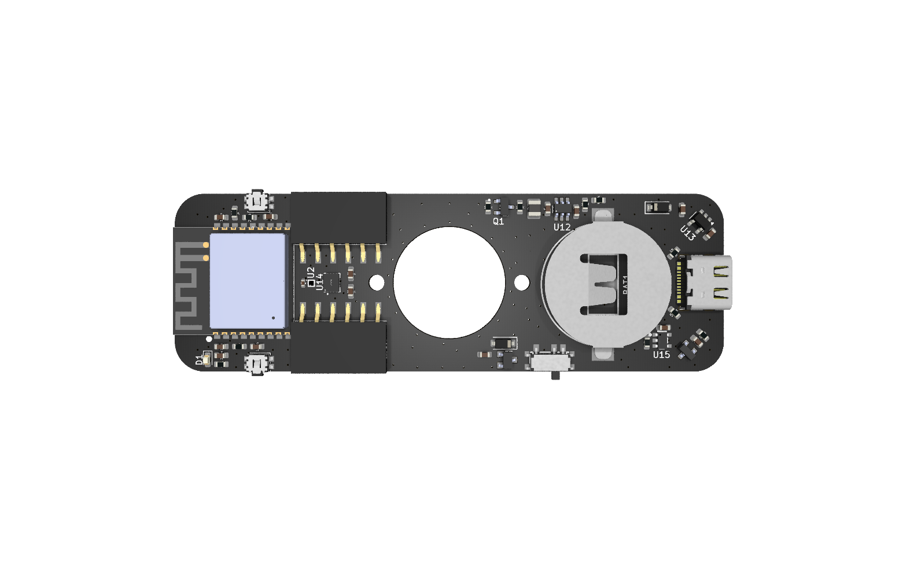

# E-SPIN Board Definitions

This repository contains the board definition and variants for the **E-SPIN**, a custom ESP32-C3 based board.



## Board Overview

- **Name**: E-SPIN
- **MCU**: ESP32-C3 (RISC-V Single Core)
- **Clock Speed**: 160 MHz
- **Flash Size**: 4 MB
- **Description**: A custom ESP32-C3 WROOM board designed as a handspinner, featuring WS2020C RGB LEDs and custom pin mapping.

## Features

- **Connectivity**: WiFi, Bluetooth 5 (LE)
- **Framework Support**: Arduino, ESP-IDF
- **Upload Speed**: 460800 baud

## Installation

### Method 1: Use as a Custom Platform (Recommended)

This repository is configured as a custom PlatformIO platform. This is the easiest way to use the board without copying files.

1.  Open your `platformio.ini`.
2.  Set the `platform` to point to this repository.
3.  Set `board = e_spin`.

```ini
[env:e_spin]
; Use this repository as the platform
platform = https://github.com/urbskali/E-spin_board.git
board = e_spin
framework = arduino
; Optional: Fix for some PIO versions to ensure variant is found
board_build.variants_dir = logic_handled_by_platform_py
```

*Note: The platform script attempts to automatically point to the variants folder inside the package.*

### Method 2: Manual Installation (Local)

1. Copy `boards/e_spin.json` to your project's `boards/` directory.
2. Copy the `variants/e_spin` folder to `variants/`.
3. Update `platformio.ini`:

```ini
[env:e_spin]
platform = espressif32
board = e_spin
framework = arduino
board_build.variants_dir = variants
```

### Why `platform_packages` didn't work

Referencing this repository via `platform_packages` (e.g., `espin@git...`) causes an `UnknownBoard` error because PlatformIO resolves the board ID **before** downloading optional packages. By defining this repository as a **Platform** (Method 1), PlatformIO downloads it first to find the board definition, and then proceeds to install dependencies (like the Arduino framework) as defined in `platform.json`.

## Pin Definitions

The pin mapping is defined in [variants/e_spin/pins_arduino.h](variants/e_spin/pins_arduino.h). It includes specific definitions for the onboard peripherals.

## License

This project is licensed under the MIT License.
